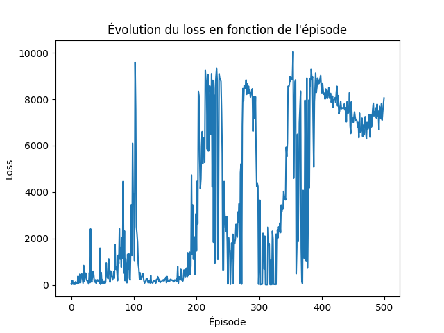
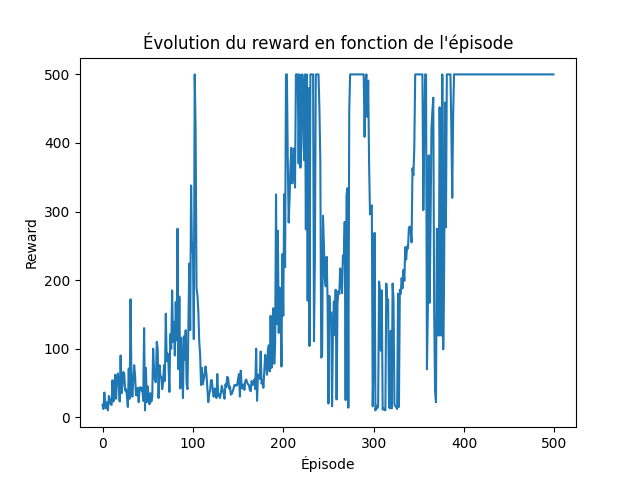

# Hands on Reinforcement Learning

## Description
In this project, we use Reinforcement Learning to train neural networks on several projects, monitor and share the progress. The first use case is the Cart Pole, for which we train a neural network thanks to the Reinforce method and then use the Stable Baseline library to perform the optimization. The second use case is the Panda Reach Joints Dense, which aims to attain every point of a space with a robotic arm.

## Usage
Running the several scripts will train the models and generate monitoring in the Weights and Bias interface.

## Results

### Reinforce Cartpole 
The results of the training of a Neural Network applied to the Cartpole Environment are displayed below :

### A2C SB3 Cartpole
The trained model can be found on Hugging Face : [a2c_sb3_cartpole](https://huggingface.co/bcornill/a2c_cartpole).
The tracking and monitoring of the training can be seen on [Weights and Biases](https://wandb.ai/bcornill/cartpole?workspace=user-bcornill).

### A2C SB3 Panda Reach
The trained model can be found on Hugging Face : [a2c_sb3_pandareach](https://huggingface.co/bcornill/pandareach).
The tracking and monitoring of the training can be seen on [Weights and Biases](https://wandb.ai/bcornill/pandareach?workspace=user-bcornill).

## Authors and acknowledgment
Author : Barnabé Cornilleau.
Following Quentin Gallouédec's [repository](https://gitlab.ec-lyon.fr/qgalloue/hands-on-rl/-/tree/main) and directives. 

## License
Copyright (c) 2023 Barnabé Cornilleau

Permission is hereby granted, free of charge, to any person obtaining a copy of this software and associated documentation files (the "Software"), to deal in the Software without restriction, including without limitation the rights to use, copy, modify, merge, publish, distribute, sublicense, and/or sell copies of the Software, and to permit persons to whom the Software is furnished to do so, subject to the following conditions:

The above copyright notice and this permission notice shall be included in all copies or substantial portions of the Software.

THE SOFTWARE IS PROVIDED "AS IS", WITHOUT WARRANTY OF ANY KIND, EXPRESS OR IMPLIED, INCLUDING BUT NOT LIMITED TO THE WARRANTIES OF MERCHANTABILITY, FITNESS FOR A PARTICULAR PURPOSE AND NONINFRINGEMENT. IN NO EVENT SHALL THE AUTHORS OR COPYRIGHT HOLDERS BE LIABLE FOR ANY CLAIM, DAMAGES OR OTHER LIABILITY, WHETHER IN AN ACTION OF CONTRACT, TORT OR OTHERWISE, ARISING FROM, OUT OF OR IN CONNECTION WITH THE SOFTWARE OR THE USE OR OTHER DEALINGS IN THE SOFTWARE.

